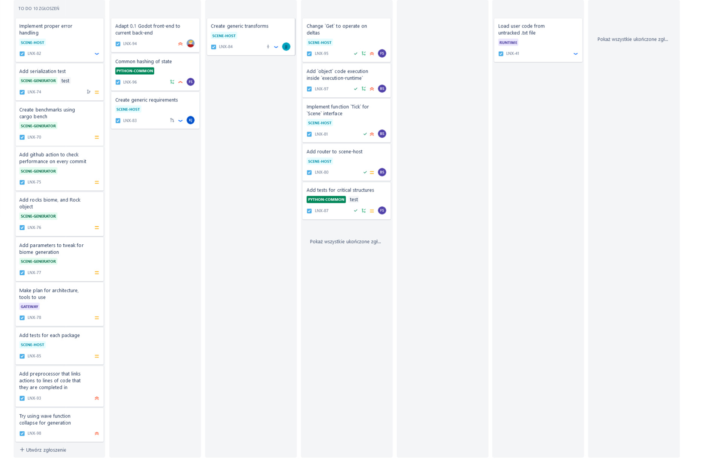

---
title: "Backlog"
titlepage: true
author: [Mateusz Grzonka, Jakub Jabłoński, Krystian Jandy, Błażej Smorawski, Filip Szweda]
date: "2023-01-24"
keywords: [Markdown, Linux]
...
# O projekcie i produkcie

Naszym produktem jest gra programistyczna, w której gracze (głównie uczniowie i nauczyciele szkół podstawowych) sterują agentami w wirtualnym świecie i za ich pomocą rozwiązują różne zadania. Zadania skupiają się wokół różnych interakcji z tym światem, na przykład zbieranie drewna, i rozwijają w użytkowniku umiejętności programistyczne.

# Persony użytkowników

## Persona 1

*Imię:* Pani Krzysia

*Wiek:* 40 lat

Zawód: Nauczyciel Informatyki w podstawówce

Charakterystyka: 

Pani Kasia jest ambitną i zaangażowaną nauczycielką, która 
chce wprowadzić swoich uczniów w świat programowania. Jest cierpliwa i kreatywna, potrafi zainteresować uczniów swoimi pomysłami. Chce aby dzieci zdobyły podstawowe umiejętności programowania i zrozumiały, jak działają jezyki programowania.

Cel użytkowania produktu:

Pani Kasia szuka gry programistycznej, która będzie atrakcyjna dla dzieci, łatwa w obsłudze i pozwoli na przyswojenie podstawowych pojęć z dziedziny programowania. Chce aby gra była interaktywna, edukacyjna i rozwijająca kreatywność.

## Persona 2

*Imię:* Kuba

*Wiek:* 10 lat

*Charakterystyka:*

 Kuba jest bardzo zainteresowany komputerami i technologią. Chce nauczyć się programowania, ale nie wie od czego zacząć. Chce znaleźć ciekawą grę, która pozwoli mu zrozumieć, jak działa komputer i jak tworzy się programy. Lubi grać w gry komputerowe, ale chce teraz spróbować swoich sił w tworzeniu własnych gier.

*Cel użytkowania produktu:*

Kuba szuka gry programistycznej, która będzie interesująca i łatwa w obsłudze. Chce, aby gra pozwoliła mu na przyswojenie podstawowych pojęć z dziedziny programowania i nauczyła go, jak tworzyć proste programy i gry. Chce, aby gra była interaktywna i dawała mu możliwość eksperymentowania i zapewniła zabawę na wiele godzin.

# Scenariusz użycia produktu

## Persona 1
Uczeń w szkole podstawowej grający w naszą grę programistyczną podczas zajęć informatycznych:
Uczeń otwiera grę i wybiera swojego agenta. Następnie otrzymuje zadanie, na przykład zbieranie drewna. Uczeń korzysta z umiejętności programistycznych, takich jak programowanie pętli i instrukcji warunkowych, aby napisać kod, który pozwoli jego agentowi zbierać drewno. Uczeń może eksperymentować z różnymi strategiami, testować swoje pomysły i dostosowywać kod w zależności od potrzeb. Podczas rozwiązywania zadań uczniowie zdobywają umiejętności programistyczne i rozwijają swoją kreatywność.

Uczeń biorący udział w rywalizacji z innymi uczniami w grze programistycznej:
Uczeń loguje się do gry i wybiera tryb gry wieloosobowej. Następnie dołącza do gry z innymi uczniami, którzy również chcą rywalizować. Każdy z uczestników otrzymuje zadanie, na przykład zbudowanie wieży z bloków, a ich agenci są ustawieni w różnych miejscach na planszy. Uczniowie korzystają z umiejętności programistycznych, takich jak programowanie pętli, aby napisać kod, który pozwoli agentowi wykonywać zadanie w jak najkrótszym czasie. Uczniowie mogą obserwować postępy innych graczy i dostosować swoje strategie w zależności od potrzeb. Po zakończeniu rundy, wyniki są wyświetlane na ekranie, a zwycięzca otrzymuje punkty i nagrody. Gry wieloosobowe pozwalają uczniom na zdobywanie umiejętności programistycznych poprzez rywalizację i współpracę z innymi graczami.

## Persona 2
Nauczyciel szkoły podstawowej wykorzystujący grę programistyczną w celach edukacyjnych:
Nauczyciel uruchamia grę i dzieli uczniów na grupy. Każda grupa otrzymuje zadanie, które wymaga zastosowania umiejętności programistycznych, na przykład zbieranie drewna lub przesuwanie bloków. Uczniowie pracują w grupach, aby napisać kod, który pozwoli ich agentom wykonywać zadania. Nauczyciel monitoruje postępy uczniów i pomaga im w razie potrzeby. Po zakończeniu rozwiązywania zadań, nauczyciel prowadzi dyskusję na temat różnych strategii i kodów, które zostały zastosowane, co pozwala uczniom nauczyć się od siebie nawzajem.

# Backlog produktu

**[SCENE-HOST]** - MEDIUM

Serwis odpowiedzialny za hostowanie plansz graczy. Udostępnia klientom gry różne możliwości interakcji
ze światem. Udostępnia różne metody takie jak na przykład `tick`, która pozwala nam odpytać agentów graczy o akcje które chcą wykonać. 

Kluczowym elementem jest obsługa wielu graczy równolegle, co jest konieczne ze względu na wieloosobową charakterystykę tej gry. Dodatkowym parametrem, który należy wziąć pod uwagę jest opóźnienie między serwerem a klientem, które nie może przekraczać 150 ms.

**[SCENE-GENERATOR]** - MEDIUM

Serwis odpowiedzialny za proceduralne generowanie mapy świata oraz za pseudolosowe rozłożenie surowców i kluczowych obiektów na mapie.

**[GATEWAY]** - LOW

Serwis odpowiadający za komunikację serwera gry z użytkownikami. Pozwala na przejrzyste i bezpieczne przesyłanie wymaganych informacji za pomocą protokołu HTTP.
Przesyłane informacje dotyczą zmian na mapie świata wprowadzonych przez zmiany użytkowników.

**[PYTHON-COMMON]** - HIGHEST

Serwis odpowiedzialny za tworzenie logiki gry, umożliwia dodawanie nowych obiektów wykorzystywanych w trakcie rozgrywki. Pozwala na tworzenie zaawansowanych obiektów i umieszczenie ich na mapie. W tym serwisie implementowane są również inne ważne aspekty rozgrywki, takie jak mechanizm do sterowania obiektami przez gracza, logiki kolizji między obiektami, czy też tworzenie animacji dla obiektów w grze.

**PRIORYTETY**

Priorytety dzielimy na:

 * HIGHEST - konieczne do działania produktu
 * HIGH - potrzebne, ale możliwe do porzucenia
 * MEDIUM - ważne, niekonieczne
 * LOW - dodatkowe

# Kryteria Akceptacji

* Gateway - Gra musi być zoptymalizowana pod kątem wydajności i szybkości przepływu informacji, aby zapewnić płynną i bezproblemową rozgrywkę dla wielu użytkowników.
* Scene-Generator - Gra musi pozwalać na wygenerowanie mapy o określonym rozmiarze i określonym algorytmie wytwarzania, dzięki czemu każda rozgrywka jest inna. 
* Scene-Host - Serwis musi działać szybko i wydajnie, bez zacięć lub opóźnień: oznacza to, że serwis musi działać sprawnie i nie powinien mieć problemów z ładowaniem się map czy zacięć w trakcie wykonywania kodu.
* Python Common - Gra musi oferować różne wyzwania związane z programowaniem, takie jak sortowanie, szukanie ścieżek, programowanie zdarzeniowe, programowanie obiektowe.

# Definicja ukończenia

* Testy w formacie Arrange, Act and Assert dla kluczowych funkcji.
* Utworzone Continuous Integration dla wszystkich komponentów.
* Skalowalność mikroserwisów do 1000 różnych użytkowników.
* Wydajność systemu określona w System Efficiency Index.
* Mechanizmy zarządzania, realizacji i współpracy agentów.
* Integracja z systemem płatności do darowizn.
